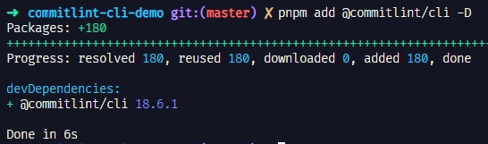
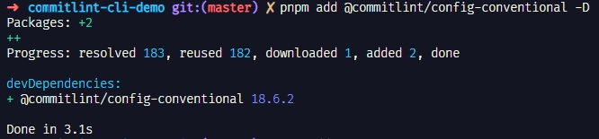
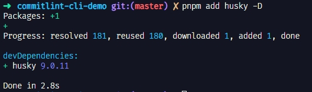
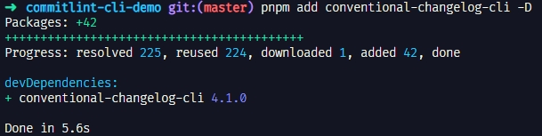

```shell
pnpm add -Dw @commitlint/cli @commitlint/config-conventional husky

echo "module.exports = { extends: ['@commitlint/config-conventional'] };" > commitlint.config.js

npx husky init

echo "npx commitlint --edit \$1" > .husky/commit-msg


# semantic-release 及 相关组件
pnpm add -Dw semantic-release @semantic-release/changelog @semantic-release/git @semantic-release/github @semantic-release/npm @semantic-release/release-notes-generator

```

# 添加 commit 规范&检查&生成 changelog

安装 `@commitlint/cli`, `@commitlint/config-conventional`




根目录下添加 commitlint.config.js 配置文件

安装 `husky`



执行 `npm pkg set scripts.prepare="husky install"`

添加 `conventional-changelog-cli`



1
2
3
4
5
